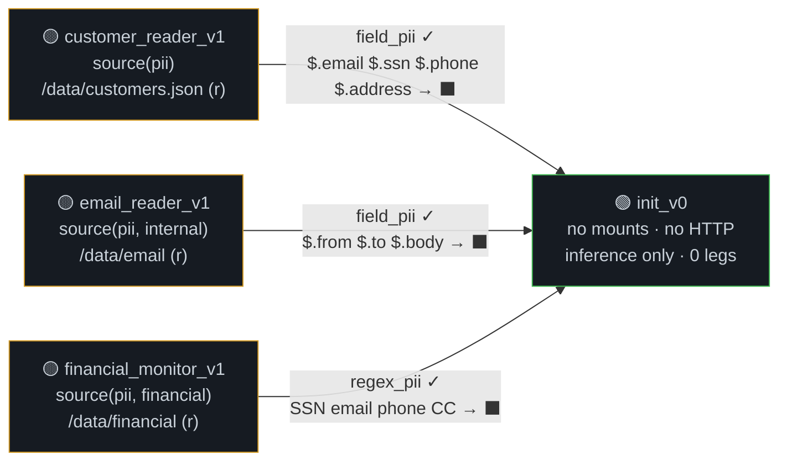

# Mediator Design Principles

**Audience:** NemoClaw core team
**Author:** Zack Aristei
**Date:** April 2026

---

## The Problem: Resource Access is Coupled to the Sandbox

Today, when an agent hits a wall — it tries to reach a URL the proxy blocks, or it needs a file that isn't mounted — the operator has two options:

1. **Approve the request in the TUI.** This adds the URL to the sandbox's network policy. Now every process in the sandbox can reach that endpoint.
2. **Reprovision the sandbox.** This adds the mount the agent needs. Now every process in the sandbox can read that data.

Both options grant access to the **entire sandbox**, not to the specific task that needed it. If the agent needs web access for research AND access to customer records for a lookup, both capabilities end up in the same sandbox policy. Every process — the agent, its tools, any subprocess — gets both. That's a prompt injection away from exfiltration.

The operator's choices are binary: approve for the whole sandbox or deny entirely. There's no way to say "this specific task can access this specific resource, but nothing else in the sandbox can."

## The Solution: Couple Resource Access to the Process, Not the Sandbox

The mediator decouples resource access from the sandbox. Instead of one policy governing the entire sandbox, **each process gets its own scoped policy.** When the agent needs a new capability, it doesn't ask the operator to widen the sandbox — it drafts a proposal for a new process with exactly the access that process needs.

The flow:

1. Agent needs web access for research → drafts a `fetcher_v1` policy (HTTP to specific URLs, no data mounts, no secrets)
2. Agent needs customer records for a lookup → drafts a `reader_v1` policy (mount `/data/customers` read-only, no HTTP, scrubbed IPC egress)
3. Operator reviews both proposals — sees structured policy configs with taint analysis, not raw URL requests
4. Agent deploys each as a separate process with its own UID, its own iptables rules, its own filesystem view
5. The fetcher can't read customer data. The reader can't reach the web. The agent coordinates via scrubbed IPC.

After the operator approves a policy once, the agent can deploy that process whenever it's needed — as a tool call. No further approval. No TUI interaction. The agent proposes, the operator validates the structure, and the agent operates autonomously within those bounds.

### Why This Matters

An autonomous agent that can't acquire new capabilities is limited to what the operator anticipated. An agent that designs its own process-level security adapts to novel tasks:

- User asks the agent to research a new topic → agent proposes a fetcher policy with the relevant URLs, deploys it as a child process
- Agent discovers it needs access to a new database → proposes a reader policy with the appropriate mounts and scrubbers
- Agent needs to parallelize work → proposes child policies with scoped access for each subtask
- Agent hits a rate limit on one provider → proposes a v2 policy with a different endpoint

The operator doesn't need to predict every possible task. They review and approve process-level policy proposals as they arise. The approval is structural (reviewing a policy config + taint analysis) not behavioral (reviewing individual HTTP requests in the TUI).

### Process-Level Isolation is an OS Primitive

This isn't a novel enforcement mechanism — it's how operating systems already work. Per-process resource isolation is built into Linux:

- **UIDs** scope filesystem access, network rules, and process visibility. Each policy gets its own UID. `iptables -m owner --uid-owner` restricts network per-process. Landlock and POSIX ACLs restrict filesystem per-process. `hidepid=2` on `/proc` hides other users' processes.
- **Seccomp** locks down the system call surface per-process. Dangerous calls (`ptrace`, `mount`, `setuid`, `memfd_create`) are blocked at the kernel level.
- **Groups (GIDs)** map to policy classes. Processes under the same policy share a GID for setgid directories. Processes under different policies are in different groups.

None of this requires custom kernel modules or container orchestration. It's standard Linux security primitives applied at the right granularity.

### Existing OS Tooling Works

Because isolation is process-level, existing OS monitoring and debugging tools apply directly:

- **`strace -p <pid>`** traces a specific workflow's system calls
- **`/proc/<pid>/net/tcp`** shows what network connections a workflow has open
- **`auditd`** rules can watch per-UID file access, network connections, IPC
- **`ss -p`** shows socket ownership by process — which workflow is talking to which
- **iptables logging** per UID shows every blocked and allowed network request

You don't need a custom observability stack. Standard Linux tools give you per-process, per-policy visibility for free.

### Declarative Trifecta Monitoring

Each policy class (and every process running under it) can be declaratively monitored for trifecta violations. The mediator computes the taint graph at policy-proposal time and serves it via a dashboard.

The graph below shows the honeypot deployment — 4 policies, scrubbed IPC channels, per-tag taint classification:



> 🟢 Green = clean (0-1 legs) · 🟡 Yellow = source only (1 leg) · 🔴 Red = trifecta (3 legs same tag)
>
> Arrows = IPC channels with scrubber name. `✓` = `de_taints: true` (breaks taint chain). `⬛` = `[REDACTED]`.
>
> **[Interactive version with click-to-inspect →](https://zaristei.github.io/nemoclaw-stack/taint-graph.html)**

Every reader has source(T) — one leg. No reader has HTTP or bind_ports — no untrusted input, no sink. IPC to init is scrubbed with `de_taints: true` — the taint chain is broken. Init has zero legs. **No trifecta anywhere in the graph.**

The graph updates live as policies are proposed and approved. The operator sees at a glance whether any policy class has a trifecta violation, which IPC channels are scrubbed, and where the data flows. A new policy proposal shows up as a projected node with its taint state — before the operator even approves it.

### The Approval Model

```
Agent identifies need → policy_propose → taint analysis runs → operator reviews
                                                                     ↓
                                            Sees: policy config, trifecta warnings,
                                            affected existing policies, scrubber gaps
                                                                     ↓
                                                            Approve / Deny
                                                                     ↓
                                            Agent forks children with approved policy
                                            (no further approval needed per action)
```

**Approve once, run many.** The operator reviews the capability set and its security implications, then the agent operates autonomously within those bounds. This is analogous to reviewing app permissions at install time vs. prompting for every file access.

### Immutability Enables Trust

Policies are immutable. `research_scraper_v1` cannot be modified after approval. To change capabilities, the agent proposes `v2`. This gives the operator confidence that what they approved is what's running — there's no drift between the approved policy and the active policy.

It also means the agent can reason about its own policy tree. It knows `v1` children have specific capabilities, `v2` children have different ones, and both can coexist. The audit trail is unambiguous.

## Design Primitives

### Syscalls: Leveraging the OS Analogy

We call them syscalls because the analogy is precise. In an operating system:

- A process cannot directly access hardware. It makes a syscall, the kernel validates against the process's permissions, and either performs the operation or returns `EPERM`.
- The boundary is enforced by hardware (ring transitions, page tables), not by asking the process nicely.

In the mediator:

- An agent cannot directly access data, the network, or other agents. It makes a syscall over a Unix domain socket, the mediator validates against the caller's policy, and either performs the operation or returns an error.
- The boundary is enforced by UID isolation, iptables, filesystem permissions, and seccomp — not by the system prompt.

### The 10 Syscalls

| Syscall | Kernel Analogy | Why It's Mediated |
|---------|---------------|-------------------|
| `policy_propose` | `exec()` with new capabilities | The agent designs its own security policies |
| `policy_list` | `ls /proc/` | Discovery — check what's available before proposing |
| `policy_get` | `cat /proc/pid/status` | Inspect a policy's scrubbers and allowlists before forking |
| `revoke_policy` | `kill -9` a capability set | Operator override, revocation propagates to all children |
| `fork_with_policy` | `fork()` + `setuid()` | Child gets its own UID, GID, iptables, Landlock |
| `signal` | `kill()` | Lifecycle management (term, kill, stop, cont) |
| `request_port` | `bind()` | Inbound traffic is an untrusted input channel |
| `ipc_send` | `write()` to a pipe | Cross-process data flow with scrubbing |
| `ipc_connect` | `socketpair()` | Bidirectional streams with policy enforcement |
| `ps` | `readdir(/proc/)` | Scoped discovery (only see what your policy allows) |

The policy CRUD syscalls (`propose`, `list`, `get`, `revoke`) are the distinctive ones. They don't exist in a traditional OS because processes don't design their own permissions. Here, the agent is expected to — that's the point.

### What Doesn't Need a Syscall

File I/O within a workflow's own mounts. Once `fork_with_policy` provisions the filesystem via Landlock + POSIX ACLs, the workflow operates at native speed. We tried mediating file access and removed it — the overhead was prohibitive and the security comes from provisioning, not per-operation checks.

## IPC as a Confinement Boundary

Processes don't share memory. They communicate via IPC — `ipc_send` and `ipc_connect`. This is where the real security happens: the mediator sits on every IPC channel and can **monitor, confine, and transform** the data flowing between policies.

### Monitoring

Every IPC message is visible to the mediator. It logs sender, receiver, timestamp, and scrubber results. You get a full audit trail of what data flowed between which processes:

```
[audit] wf_customer → init_v0 | ipc_send | field_pii applied: 4 redactions ($.email, $.ssn, $.phone, $.address)
[audit] wf_email → init_v0 | ipc_send | field_pii applied: 3 redactions ($.from, $.to, $.body)
```

Combined with the OS-level monitoring (strace, auditd per-UID), you get complete visibility into both the data plane (what crossed which IPC channel) and the control plane (which syscalls each process made).

### Schema Confinement

IPC channels can enforce a JSON schema on every message. The `schema_enforcer` scrubber rejects messages that don't conform:

```yaml
allowed_ipc_targets:
  - policy_name: "processor_*"
    scrub_egress:
      scrubber: schema_enforcer
      data_types: [pii]
      config:
        schema:
          type: object
          properties:
            query: {type: string, maxLength: 200}
            results: {type: array}
          required: [query, results]
          additionalProperties: false
```

A process can't inject unexpected fields, send oversized payloads, or change the message structure. The receiving process only sees data in the shape it declared. This constrains the attack surface — even if a process is compromised, its IPC output is structurally confined.

### PII Scrubbing

IPC channels can strip PII from messages before they cross a trust boundary. The agent specifies which fields to scrub and how:

```yaml
allowed_ipc_targets:
  - policy_name: "init_v0"
    scrub_egress:
      scrubber: field_pii
      data_types: [pii]
      config:
        fields: ["$.email", "$.ssn", "$.phone", "$.address"]
        action: redact   # or: hash (deterministic, joinable)
```

The receiving process sees `[REDACTED]` where the SSN was. It can reason about the data ("Sarah Chen has a balance of $84,230") without ever seeing the raw PII. Even if the receiving process is fully compromised — jailbroken LLM, injected prompt, whatever — it cannot exfiltrate data it never received.

For natural language PII (names, addresses in free text), the `ner_pii` scrubber calls an NER model (Presidio) to detect and redact entities that regex would miss.

### Injection Defense

Content from untrusted sources (web pages, emails, user messages) can carry prompt injection. IPC scrubbers defend against this:

- **`instruction_strip`** removes known injection patterns (chat markers, role prefixes, invisible Unicode, base64 instruction blocks)
- **`delimiter`** wraps untrusted content in boundary tags with a random nonce, making the trust boundary explicit in the token stream
- **`canary`** injects tracking tokens into untrusted content on ingress, then detects them in outbound messages on egress — catching exfiltration attempts

These are defense-in-depth layers. They reduce injection risk but don't eliminate it — a sufficiently creative injection can bypass heuristic patterns. The structural defense (the process that handles untrusted content doesn't have access to sensitive data) is what provides the hard guarantee.

### Mutual Consent

IPC is bidirectional by default but requires **mutual consent**. Both policies must list each other in `allowed_ipc_targets`. A compromised process can't unilaterally open a channel to a process it shouldn't talk to. The operator sees the full IPC graph in the taint dashboard and can verify that only intended channels exist.

## The Init Coordinator Pattern

Init is the root agent process. In earlier designs it had wildcard permissions — HTTP, IPC, mounts, everything. This made it a permanent trifecta violation.

Current design: init has **no HTTP except the inference endpoint**, no sensitive mounts, no bind_ports. It coordinates by forking children with scoped policies. Results come back scrubbed.

This means the LLM — the most attackable component (prompt injection, jailbreaks) — never touches raw PII. It reasons about `[REDACTED]` data. Even a fully compromised model can't leak what it never received.

The inference endpoint is classified as trusted because init uses a key scoped to zero-data-retention providers. The trust classification of the inference URL is what closes the sink leg.

## What This Enables

### Self-Organizing Agent Workflows

The agent doesn't need a predefined workflow. It receives a task, analyzes what capabilities it needs, proposes policies, and builds the workflow at runtime. A "research quantum computing" task becomes:

1. Agent proposes `fetcher_v1` (arxiv HTTP, scrubbed IPC to coordinator)
2. Agent proposes `kb_reader_v1` (internal KB mount, scrubbed IPC)
3. Operator approves both (taint analysis: no trifecta)
4. Agent forks both, coordinates via IPC, collects scrubbed results

Next time the agent gets a similar task, the policies already exist. `policy_list` shows them, `policy_get` confirms they fit, `fork_with_policy` creates children immediately — no approval round-trip.

### Blueprint Policy Presets

Common patterns can be pre-approved in the NemoClaw blueprint. A "research assistant" blueprint ships with reader, fetcher, and coordinator policies. The agent forks them without waiting. The operator approved the blueprint once.

### Graduated Autonomy

New agents start with no pre-approved policies. Every capability requires operator approval. As trust builds, the operator pre-approves more policies in the blueprint. Eventually the agent operates fully autonomously within a rich policy set, only proposing new policies for genuinely novel tasks.

### Cross-Sandbox Communication (Future)

The same policy/IPC/scrubber model extends to cross-sandbox channels. Two NemoClaw instances could communicate via gateway-mediated IPC with mutual consent and scrubbing — the same semantics, different transport.

## Implementation Status

### Complete

| Component | Tests |
|-----------|-------|
| 10 syscalls over UDS | 135 unit + 10 integration |
| Per-tag taint analysis | 10 trifecta e2e |
| 8 scrubber types (regex, field, NER, schema, canary, delimiter, instruction strip) | 27 unit |
| Implicit sensitivity (clean writers produce sensitive data) | 3 unit |
| mediator-daemon + mediator-cli (cross-compiled Linux aarch64) | Deployed to sandbox |
| NemoClaw entrypoint hook (backward compatible) | — |
| Agent syscall guide (467 lines) | — |
| Doc workflow e2e tests (5 scenarios from design doc) | 5 e2e |
| Full-stack lifecycle test (propose → fork → IPC → scrub → signal → revoke) | 1 e2e |
| **Total** | **161 tests, all passing** |

### Next: Deployment & Security Testing

| Item | Description |
|------|-------------|
| End-to-end deployment testing | Full stack boot → sandbox creation → mediator daemon → agent workflow execution, verified in CI |
| NemoClaw plugin integration | Register mediator tools as native OpenClaw tools (not shell wrappers) |
| Bake binaries into container image | Eliminate manual upload — mediator-daemon + mediator-cli built into Dockerfile |
| Blueprint-level policy presets | Pre-approved policies ship with the NemoClaw blueprint, no runtime approval needed |
| Red team security audit | Structured adversarial testing: prompt injection via IPC, scrubber bypass attempts, policy escalation, side-channel exfiltration |
| Scrubber coverage verification | Validate that declared scrubber fields match actual data shapes across all policies |
| ipc_connect frame-level scrubbing | Currently raw byte relay — needs length-prefixed JSON framing for per-message scrubbing on streams |
| Cross-sandbox IPC | Extend mediator model to gateway-mediated channels between separate NemoClaw instances |
